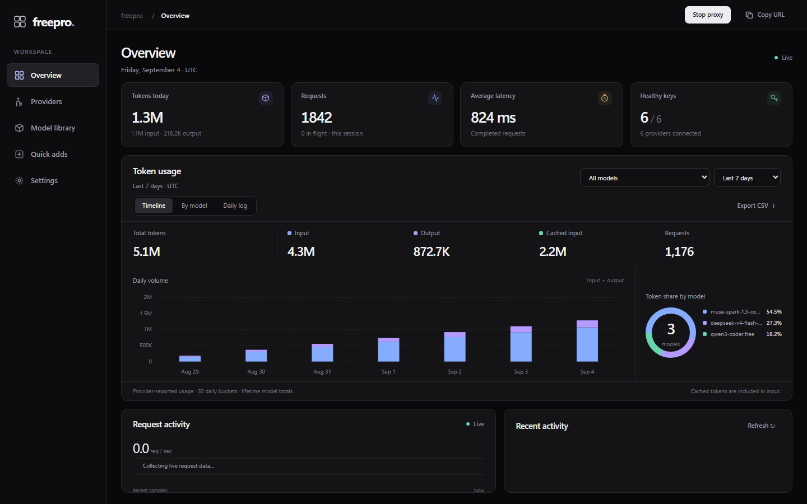
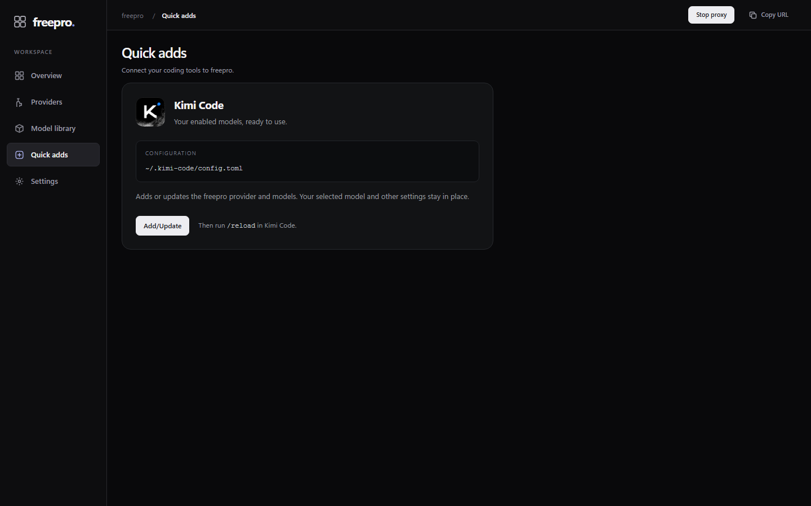
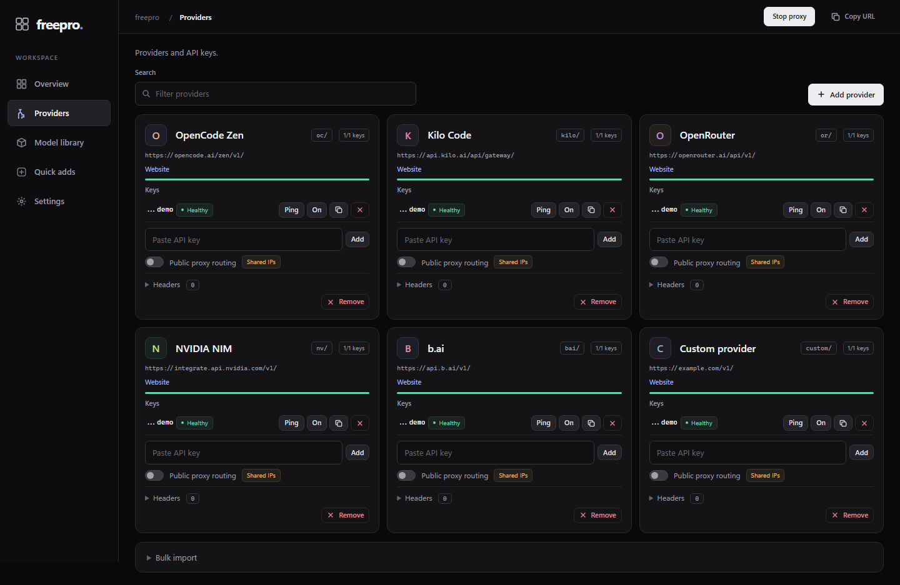
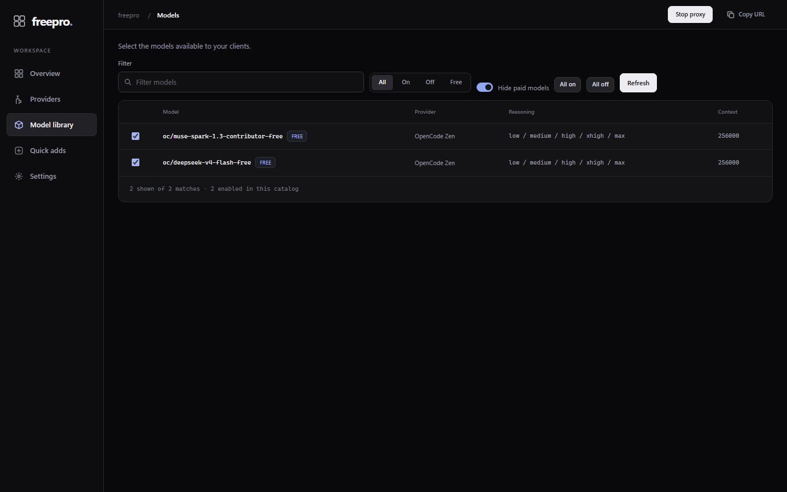
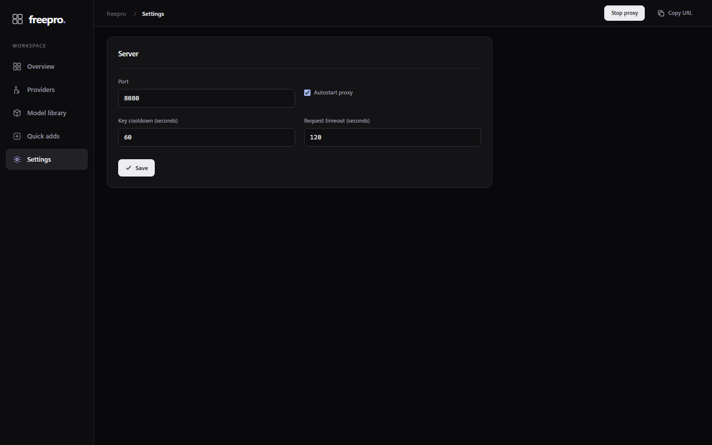

<div align="center">

# freepro

**Free AI models. One local endpoint.**

A lightweight model proxy with an OpenAI-compatible API, automatic key rotation, and a compact dark dashboard.

[Download v0.1.4](https://github.com/menscho/freepro/releases/tag/v0.1.4) · [Getting started](#getting-started) · [Build from source](#build-from-source)


</div>



*Screenshots show the real dashboard with sample data.*

## What it does

- **One endpoint:** connect coding tools to `http://127.0.0.1:54321/v1`. If that port is already taken, freepro listens on the next free port instead and tells you which one.
- **Provider management:** add keys, customize headers, test connectivity, and rotate across available keys.
- **Model library:** choose which models clients can see, filter paid models, and configure reasoning levels.
- **Usage you can inspect:** input, output, cached tokens, model breakdowns, daily history, and CSV export.
- **Kimi Code setup:** add or update the local configuration with one button, then run `/reload`.
- **Optional public proxy routing:** configure it per provider, built on the model of the well-known `proxy_pool` project. **Twenty-six live sources** — the big aggregates plus frequently-refreshed 5-minute lists and latency/uptime JSON feeds — rotate through a reservoir of up to 80,000 candidates. A background getter re-pulls the lists every 5 minutes; a background tester keeps validating raw candidates AND re-probing pooled routes against a **neutral HTTPS target** (not your model provider), so a proxy's health reflects whether the proxy itself works — never whether an upstream is rate-limiting you today. Proxies are reused and only dropped when they fail the neutral probe or transport repeatedly; a proxy that recovers is re-promoted (a successful request or probe lowers its failure score). If the pool runs low under load, a fresh fetch starts immediately. 429/403 cools the affected routes without deleting them. Rejections through several routes only pause requests when no eligible capacity remains; fresh or busy eligible routes are still tried within the retry budget. 40 validators target 128 ready routes. Anonymous providers may also get a complete JSON catalog check; validators never send synthetic model completions. Only successful real requests earn route preference. A 429 adds no synchronous neutral probe, cooldowns preserve Retry-After, and a late success cannot erase a newer cooldown. Bursts queue first-come-first-served for up to 30 seconds within the request timeout (128 waiters maximum). Catalog access alone cannot guarantee a generation request will be accepted. A single-instance lock prevents two launches from writing the same configuration. The local server supports 128 connections, with inbound and downstream write deadlines to release abandoned clients. Retries share the configured timeout; a partial stream is never replayed. This feature is experimental; proxy availability and upstream limits still apply.
- **Updates on your terms:** check GitHub once at startup; show an Update button only when a newer compatible release is available.

The GUI is served locally and opens in your browser. Its HTML, styles, scripts, and logo are embedded in the executable—no Node.js server or frontend installation is needed.

## Download

| Platform | Standalone download |
| --- | --- |
| Windows 10/11 · x64 | [freepro.exe](https://github.com/menscho/freepro/releases/download/v0.1.4/freepro-v0.1.4-windows-x86_64.exe) |
| Linux · x64 | [freepro](https://github.com/menscho/freepro/releases/download/v0.1.4/freepro-v0.1.4-linux-x86_64) |
| Linux · ARM64 | [freepro](https://github.com/menscho/freepro/releases/download/v0.1.4/freepro-v0.1.4-linux-arm64) |
| macOS · Apple Silicon | [freepro](https://github.com/menscho/freepro/releases/download/v0.1.4/freepro-v0.1.4-macos-arm64) |
| macOS · Intel | [freepro](https://github.com/menscho/freepro/releases/download/v0.1.4/freepro-v0.1.4-macos-x86_64) |

Windows ships as a standalone `.exe`. Linux builds use static musl. macOS builds are unsigned command-line executables that launch the browser GUI; macOS may require approval in **System Settings → Privacy & Security**. Release checksums are available in [SHA256SUMS](https://github.com/menscho/freepro/releases/download/v0.1.4/SHA256SUMS).

## Getting started

1. Download the build for your platform and place it in a folder you can write to.
2. On Windows, launch the `.exe`. On Linux or macOS, make the download executable and run it:

   ```sh
   chmod +x ./freepro-v0.1.4-linux-x86_64
   ./freepro-v0.1.4-linux-x86_64
   ```

   Substitute your downloaded filename on macOS or ARM64.

3. The dashboard opens at **http://127.0.0.1:54321** — or the next free port, if something already holds that one; the launch terminal and the dashboard header both show the port in use. In **Providers**, add the keys required by your providers.
4. In **Model library**, enable the models you want to use.
5. Set your coding tool's base URL to `http://127.0.0.1:54321/v1` and select a model ID from `/v1/models`.

If your client requires an API key for the local endpoint, use a placeholder such as `freepro-local`. Upstream provider keys are configured in the dashboard. The local service binds to loopback and is intended for use on your own machine.

Keep freepro running while using your coding tool. In the launch terminal, `quit` saves data and exits; `open` reopens the dashboard. **Stop proxy** stops serving requests. Set `FREEPRO_NO_BROWSER=1` to suppress automatic browser opening.

### Kimi Code

Open **Quick adds → Kimi Code → Add/Update**, then run **`/reload`** in Kimi Code.

freepro locates `~/.kimi-code/config.toml` automatically (`%USERPROFILE%\.kimi-code\config.toml` on Windows). It adds or updates the `freepro` provider and enabled models, preserving other providers, custom settings, and your selected model. The first existing configuration is backed up as `config.toml.freepro.bak`; subsequent identical updates leave the file untouched.



### Providers and models

Provider prefixes keep model IDs unambiguous, such as `oc/muse-spark-1.3-contributor-free`. Provider availability, model names, free quotas, and supported reasoning levels depend on the upstream service. freepro exposes the configured levels and adapts supported request formats; it does not grant access to paid models or increase a provider's quota.



<details>
<summary>Model library and settings</summary>




</details>

## Updates and saved data

At startup, freepro checks the latest stable release in this repository. If it contains a newer build for your platform and its checksum manifest, an **Update** button appears at the bottom of the sidebar. No background polling of GitHub runs after that check.

Clicking the button downloads and verifies the release, waits for active requests to finish, saves settings and usage, replaces the executable, and restarts the GUI. Downloads are staged beside the app. The previous executable remains as `<executable>.previous`; failed downloads leave the running app untouched. The app folder must be writable.

Data lives separately from the executable:

| OS | Configuration and usage |
| --- | --- |
| Windows | `%APPDATA%\freepro\freepro_config.json` |
| Linux | `$XDG_CONFIG_HOME/freepro/freepro_config.json` or `~/.config/freepro/freepro_config.json` |
| macOS | `~/Library/Application Support/freepro/freepro_config.json` |

The config contains provider credentials. Keep it private. Usage is saved periodically and on clean shutdown. Daily usage retains 30 buckets; per-model lifetime totals are retained separately.

## Build from source

Install **[Zig 0.16.0](https://ziglang.org/download/0.16.0/)** and Git. There are no third-party Zig dependencies. All default and release builds produce the GUI app.

```sh
git clone https://github.com/menscho/freepro.git
cd freepro
zig build -Doptimize=ReleaseSafe
```

Launch `zig-out/bin/freepro-gui.exe` on Windows, or `./zig-out/bin/freepro-gui` on Linux/macOS. For development:

```sh
zig build run
zig build test
```

Build a specific platform:

```sh
zig build -Dtarget=x86_64-windows -Doptimize=ReleaseSafe
zig build -Dtarget=x86_64-linux-musl -Doptimize=ReleaseSafe
zig build -Dtarget=aarch64-macos -Doptimize=ReleaseSafe
```

Build all five release targets:

```sh
zig build release-all -j2
python scripts/package_release.py
```

The packaging script writes versioned GUI executables and `SHA256SUMS` to `release/`. Each executable embeds the dashboard. CI builds and tests on Windows, Linux, and macOS.

### Project layout

```text
src/gui_main.zig    GUI app lifecycle and local server
src/proxy.zig       OpenAI-compatible routing and forwarding
src/responses.zig   Responses/chat protocol translation
src/dashboard.zig  Dashboard API and embedded assets
src/web/           Dashboard HTML, CSS, and JavaScript
src/quickadd.zig    Safe Kimi Code configuration updates
src/updater.zig     GitHub releases and native update helper
src/metrics.zig    Usage tracking and persistence
scripts/           Integration checks and release packaging
```

## License

[MIT](LICENSE). Third-party notices and the Kimi logo attribution are listed in [NOTICE.md](NOTICE.md).
